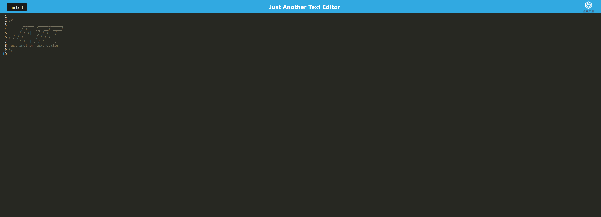

# Jaysons-pwa-text-editor

## Table of Contents
- [Description](#description)
- [screenshot](#screenshot)
- [Usage](#usage)
- [DeployedApp](#DeployedApp)

## Description
Given starter code for this text editor project i added DB,local caching,and PWA install capabilities for JATE.This text editor uses IndexedDB to create an object store and includes both GET and PUT methods and works without an internet connection.JATE can also be installed on your machine as a progressive web application.

## screenshot

## Usage 
This application is a text editor that can be used in your browser,or be installed to your pc or mobile device.Users can also use this application without an internet connection.

## DeployedApp
Deployed App: https://jayson-text-editor-c5359fdf83b0.herokuapp.com/

